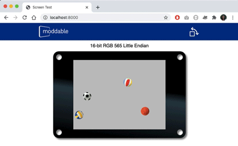

# Wasm

Copyright 2019-2020 Moddable Tech, Inc.<BR>
Revised: December 1, 2020

This document provides instructions to build and run Moddable SDK apps for the Wasm platform.



## Table of Contents

- Setup instructions

	| [](#mac) | [](#lin) |
	| :---: | :---: |
	| [Setup instructions](#mac) | [Setup instructions](#lin)
	
- [Limitations](#limitations)

<a id="mac"></a>
## macOS

1. Clone the [Emscripten](https://emscripten.org/) repository into your `~/Projects` directory and activate the latest version.

	```text
	cd ~/Projects
	git clone https://github.com/emscripten-core/emsdk.git
	./emsdk install latest
	./emsdk activate latest
	```
	
	If you already have the Emscripten repository, upgrade to the latest version using the following commands:
	
	```text
	cd ~/Projects/emsdk
	git pull
	./emsdk install latest
	./emsdk activate latest
	```
	
	> We last tested using version 2.0.1 (commit `4ee902fd6963233f6be8b818eebd529ae406221e`).
		
2. Clone the [Binaryen](https://github.com/WebAssembly/binaryen) repository into your `~/Projects` directory and build it.

	```text
	cd ~/Projects
	git clone https://github.com/WebAssembly/binaryen.git
	cd binaryen
	cmake . && make
	```
	
	> We last tested using wasm-opt version 96 (commit `2105214971e722525c328a23a5d215789fafb24c`)	
3. 	Setup the `PATH` and other environment variables by pasting the following commands into your `~/.profile`. The first command sources a shell script that sets environment variables for Emscripten. The second updates your `PATH` to include BinaryEn.

	```text
	source ~/Projects/emsdk/emsdk_env.sh
	export PATH=~/Projects/binaryen/bin:$PATH
	```

	> Note: These instructions assume that your shell sources from `~/.profile` when a new terminal is opened. That may not be the case depending on what shell you use and how you have it configured. Starting with macOS Catalina, the [default shell is `zsh`](https://support.apple.com/en-us/HT208050) which uses `~/.zshrc` instead.

	> Note: You must open a new shell instance or manually run the export statements in your shell before proceeding. Adding the export statements to your `~/.profile` does not update the environment variables in active shell instances.

4. Build the Moddable Wasm tools from the command line:

	```text
	cd ${MODDABLE}/build/makefiles/wasm
	make
	```
	
5. To test, build the `balls` example for the `wasm` target.

	```text
	cd $MODDABLE/examples/piu/balls
	mcconfig -d -m -p wasm
	```
	
	You can run the app that's built in the browser by hosting it on a local HTTP server. Python provides a simple tool for doing this.
	
	If you are using Python 2:
	
	```text
	cd $MODDABLE/build/bin/wasm/debug/balls
	python -m SimpleHTTPServer
	```
	
	If you are using Python 3:
	
	```text
	cd $MODDABLE/build/bin/wasm/debug/balls
	python3 -m http.server
	```
	
	Go to [`localhost:8000`](http://localhost:8000) in a browser. You should see a web page with a simulator running `balls`.
	
<a id="lin"></a>
## Linux

1. Clone the [Emscripten](https://emscripten.org/) repository into your `~/Projects` directory and activate the latest version.

	```text
	cd ~/Projects
	git clone https://github.com/emscripten-core/emsdk.git
	./emsdk install latest
	./emsdk activate latest
	```
	
	If you already have the Emscripten repository, upgrade to the latest version using the following commands:
	
	```text
	cd ~/Projects/emsdk
	git pull
	./emsdk install latest
	./emsdk activate latest
	```
	
	> We last tested using version 2.0.4 (commit `88b4ec65923815c3077e3637eefb54ab272d2646`).
		
2. Clone the [Binaryen](https://github.com/WebAssembly/binaryen) repository into your `~/Projects` directory and build it.

	```text
	cd ~/Projects
	git clone https://github.com/WebAssembly/binaryen.git
	cd binaryen
	cmake . && make
	```
	
	> We last tested using wasm-opt version 96 (commit `a96e8310e1a58c0a43b2d0e2ff4f9db24dd9a18a`)	
3. 	Setup the `PATH` and other environment variables by pasting the following commands into your `~/.bashrc`. The first command sources a shell script that sets environment variables for Emscripten. The second updates your `PATH` to include BinaryEn.

	```text
	source ~/Projects/emsdk/emsdk_env.sh
	export PATH=~/Projects/binaryen/bin:$PATH
	```

	> Note: You must open a new shell instance or manually run the export statements in your shell before proceeding. Adding the export statements to your `~/.profile` does not update the environment variables in active shell instances.

4. Build the Moddable Wasm tools from the command line:

	```text
	cd ${MODDABLE}/build/makefiles/wasm
	make
	```
	
5. To test, build the `balls` example for the `wasm` target.

	```text
	cd $MODDABLE/examples/piu/balls
	mcconfig -d -m -p wasm
	```
	
	You can run the app that's built in the browser by hosting it on a local HTTP server. Python provides a simple tool for doing this.
	
	If you are using Python 2:
	
	```text
	cd $MODDABLE/build/bin/wasm/debug/balls
	python -m SimpleHTTPServer
	```
	
	If you are using Python 3:
	
	```text
	cd $MODDABLE/build/bin/wasm/debug/balls
	python3 -m http.server
	```
	
	Go to [`localhost:8000`](http://localhost:8000) in a browser. You should see a web page with a simulator running `balls`.

<a id="limitations"></a>
## Limitations

Not all features of the Moddable SDK are supported in the Wasm simulator. 

The following features are currently supported:

- All JavaScript features supported by XS
- Piu user interface framework
- Commodetto graphics library

The following features are not supported:

- Files
- Socket
- BLE
- Pins/IO
	